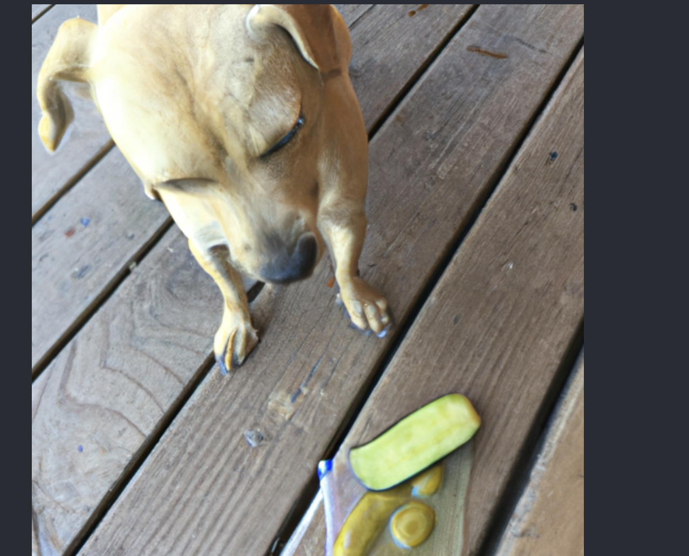

# aiPIC

## Description
This project is an AI-powered picture generator that utilizes the following technologies: Apollo, Node.js, OpenAI, React, MongoDB, GraphQL, and Express. It enables users to generate unique and creative pictures using artificial intelligence algorithms.?

## Installation

What are the steps required to install your project? Provide a step-by-step description of how to get the development environment running.

## Usage
aiPIC is a simple AI picture generator that is easy to use. You create an account by clicking the login/sign up button. After you create an account all you need to do is type in a description of the image you want to see and then click the "generate an image"button. After you click the "generate an image" button, you image will appear at the bottom of the page.

## License

## Features
Free to Use: Unlike many AI image generators, our solution is completely free to use. We believe in democratizing access to AI technology and making it available to everyone.

No API Charges: By developing the image generator in-house, we eliminate the need for costly API calls, ensuring that users can create images without incurring any expenses.

## Contributors
Nicholas M.
Gary D.
Nico A.

